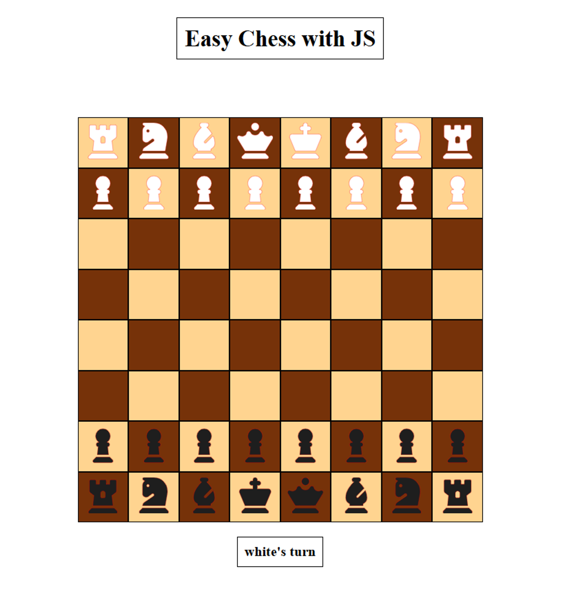

<h1>Easy Chess with JavaScript</h1>

  

<h3>

Access it here: <a href="https://m0hith.github.io/Easy-Chess-with-JS/" target="_blank">Play Now</a>

</h3>

## Introduction

This is a minimalistic implementation of a chess game using only HTML, CSS, and JavaScript.
It is designed to provide a straight-forward chess game experience.

## Setup

To get started with the Easy Chess game, do the following:

1. Clone or download the repository to your local machine.
2. Open the `index.html` file in your preferred code editor.
3. Make any changes required and run the file using its absolute path in your preferred browser.
4. The chessboard will be displayed, ready for playing.

## Instructions

1. Open the game in your web browser.
2. White starts the game, always.
3. Pieces are designed to be dragged and dropped as per their valid conventional chess moves.
4. The game doesn't include advanced features like check detection, checkmate, move highlightation or pawn promotion.

Remember, this project is designed to be a simple implementation of chess, without complex rules or interactions.

## Thoughts

Thank you for checking out this simple game of chess project! If you have any questions, or feedback, please feel free to reach out to me!

<h3>

LinkedIn: <a href="https://www.linkedin.com/in/mo-hith/" target="_blank" rel="noopener noreferrer">Mohith Jarapala</a>

</h3>
